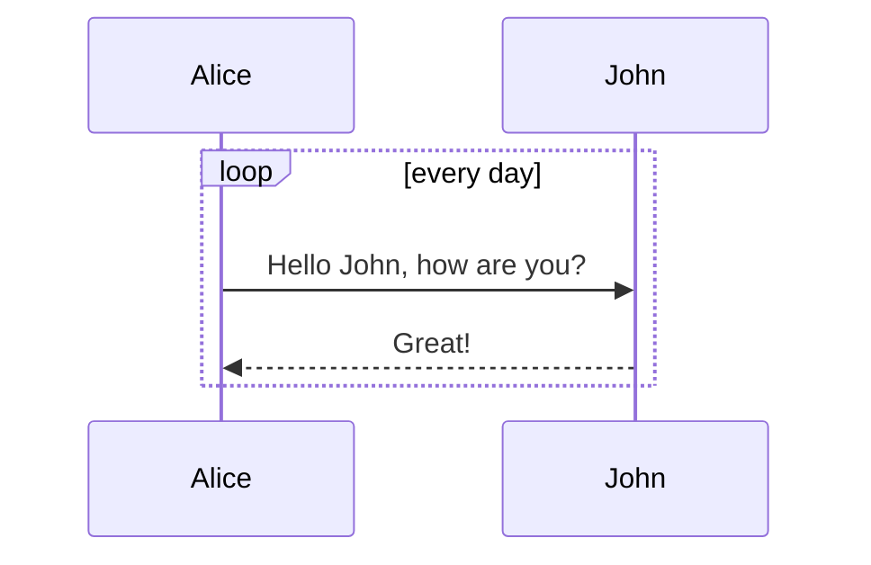

## Text Formatting

Headers
---------------------------

# Header 1

## Header 2

### Header 3

Styling
---------------------------

*Emphasize*  _emphasize_

**Strong**  __strong__

`highlighted`

==Marked text.==

~~Mistaken text.~~

> Quoted text.

> Quotation
>> Quotation Quotation
>>> Quotation Quotation

### Superscript:

H~2~O is a liquid.

2^10^ is 1024.

Lists
---------------------------

- Item
	- item
		- item
			- item
				- item
- Item
	 * Item
		 + Item

1. Item 1
2. Item 2
3. Item 3

- [ ] Incomplete item
- [x] Complete item

Links
---------------------------

`Simple link`:  https://fr.wikipedia.org/wiki/Markdown  
`Named link`:   [Markdown — Wikipédia](https://fr.wikipedia.org/wiki/Markdown)  
`Tooltip link`: [Hover Me](https://fr.wikipedia.org/wiki/Markdown "A cool tooltip")

Code
---------------------------

Some `inline code`.

```
// A code block
var foo = 'bar';
```

```javascript
// An highlighted block
var foo = 'bar';
```

```js
Render: function () {
  Return (
    <Div className = “commentBox”>
      <H1> Comments </ H1>
      <CommentList data = {this.state.data} />
      <CommentForm onCommentSubmit = {this.handleCommentSubmit} />
    </Div>
  );
}
```

Tables
---------------------------

Item | Value
-------- | -----
Computer | $1600
Phone | $12
Pipe | $1 

==***==

| Column 1 centered | Column 2 right-aligned |
|:--------:| -------------:|
| centered | right-aligned | 

==***==

|First Header  | Second Header | Third Header |
| ------------ | :-----------: | -----------: |
|Content       |          *Long Cell*        ||
|Content       |   **Cell**    |         Cell |
|New section   |     More      |         `Data` |


==***==

Markdown | Less | Pretty
--- | --- | ---
*Still* | `renders` | **nicely**
1 | 2 | 3


LaTeX math
---------------------------

The Gamma function satisfying $\Gamma(n) = (n-1)!\quad\forall
n\in\mathbb N$ is via the Euler integral

$$
\Gamma(z) = \int_0^\infty t^{z-1}e^{-t}dt\,.
$$

$$[x^n + y^n = z^n]$$
$$\frac{d}{dx}\left( \int_{0}^{x} f(u)\,du\right)=f(x).$$

Abbreviations
---------------------------

Markdown converts text to HTML.

*[HTML]: HyperText Markup Language

The HTML specification
is maintained by the W3C.

*[W3C]: World Wide Web Consortium

### Footnotes
Here is a footnote reference,[^1] and another.[^longnote]

[^1]: Here is the footnote.
[^longnote]: Here's one with multiple blocks.

    Subsequent paragraphs are indented to show that they
belong to the previous footnote.

### Emoticons
Emoji by shortcode: :books: :memo: :eyes:
Emoji by Unicode:   📚 📝 👀
[complete emoji list](https://www.webpagefx.com/tools/emoji-cheat-sheet/)

## Structuring

### List
* List 1
* List 2
	1. First ordered list item
	 Second line
	2. Another item

### Block
	Some Infor First Line - Lorem ipsum dolor sit amet, consetetur sadipscing eli
	Some Infor Second Line - Lorem ipsum dolor sit amet, consetetur sadipscing eli
	Some Infor Third Line - Lorem ipsum dolor sit amet, consetetur sadipscing eli

### Horizontal line
Horizontal lines have various ways of writing.

* * *
***
---

## Image
`Default:` 
`Resized:` 
`Streched:` 
`By Reference:` ![Referneced Style][logo]

[logo]: https://upload.wikimedia.org/wikipedia/commons/thumb/4/48/Markdown-mark.svg/175px-Markdown-mark.svg.png "Boostnote Logo"

## Diagram Integrations

### [mermaid](https://mermaidjs.github.io/)

